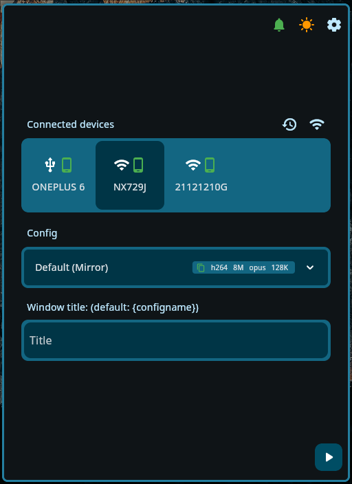
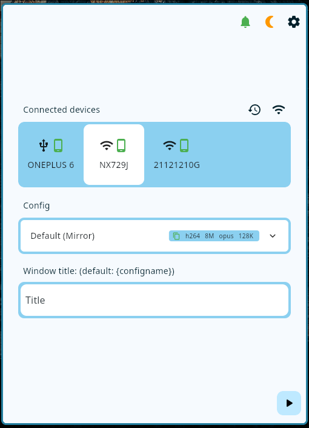
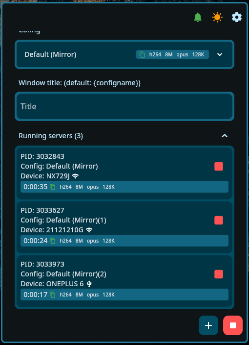
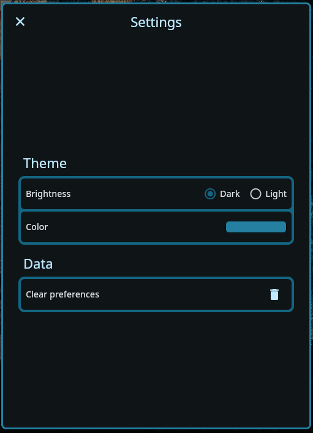
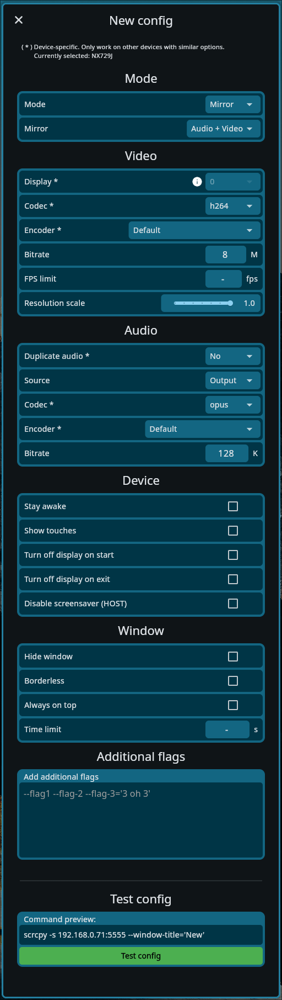

# Flutter Scrcpy-GUI

A gui for [Scrcpy](https://github.com/Genymobile/scrcpy), made with Flutter.

## Note

- Beginner dev / messy code - this project was made as an effort for me to learn flutter.

- Some features may or may not work as intended on Mac/Windows as this project is developed and tested on Linux with my personal use in mind.

## Requirements

### Linux & MacOS

To be installed and be available in PATH.\
Refer [scrcpy](https://github.com/Genymobile/scrcpy?tab=readme-ov-file#get-the-app) for installation.

- scrcpy
- adb

### Windows

- Nothing

## Features

- Wireless ADB connect with history.
- Automatically set wireless device to listen to port 5555 on first connection.
- Ease of use for setting up and running scrcpy command.
- Save scrcpy config.
- List of running scrcpy instances. (only on Linux)
- Theming - dark/light + accent color.
- Tray support (start/stop servers)

## Preview

| Main-Dark  | Main-Light | Running instance | Settings | Config
| ------------- | ------------- | ------------- | ------------- | -------------
|   |   |  |  | 

## License

GNU GPLv3

## Credits

- [scrcpy](https://github.com/Genymobile/scrcpy)
